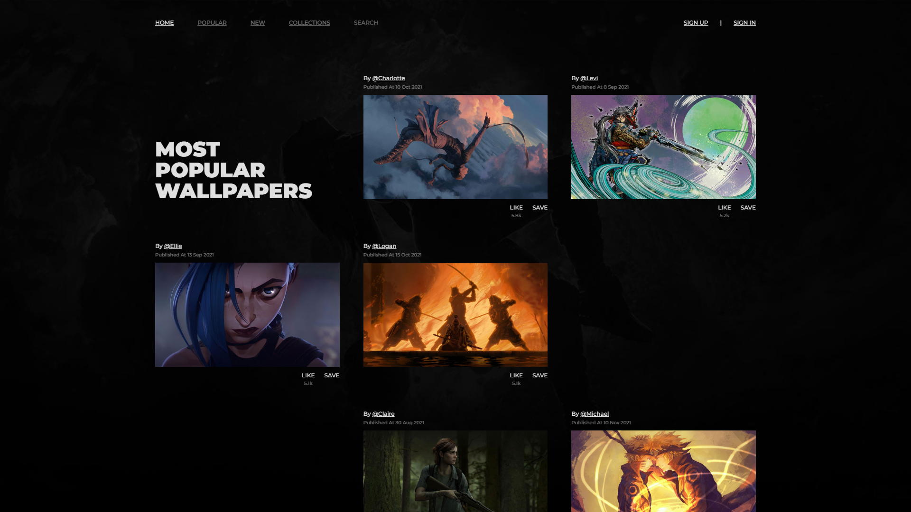
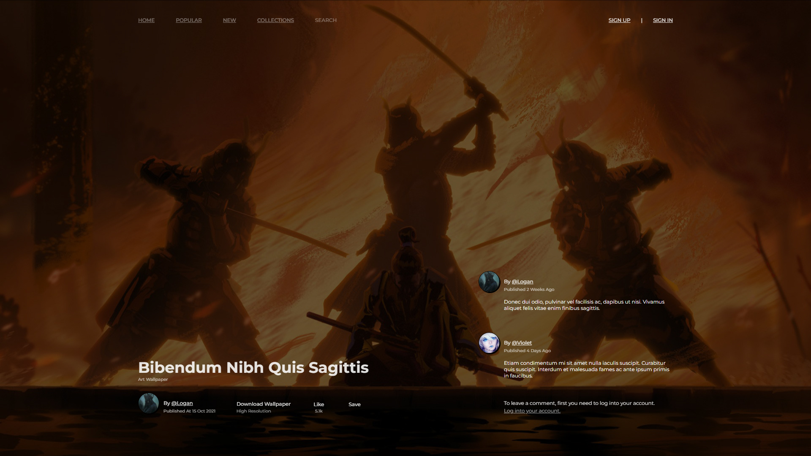
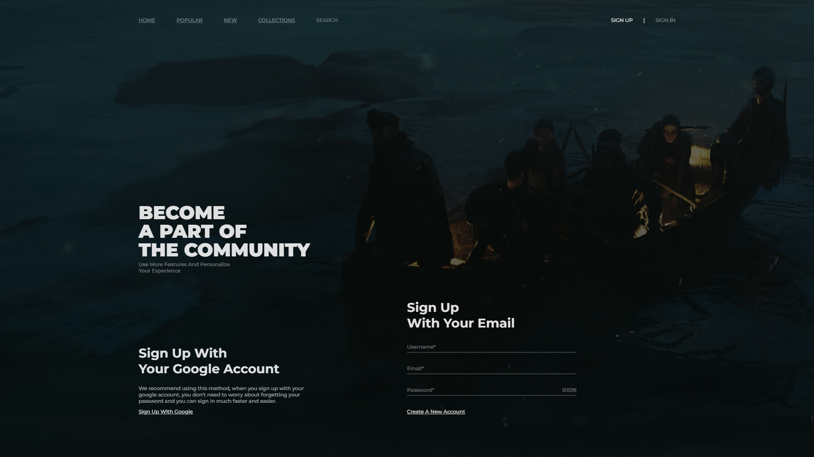

# Wallpapers Web Application

[Live Demo](https://wallpapers-1fug.onrender.com) • A full-stack web application that's a collection of some of my favorite desktop wallpapers. Users can easily lookup wallpapers in full screen and download, like and save them and even leave comments on their favorite wallpaper’s page.

## Key Features

- User authentication (Local + Google OAuth)
- Like, save, download and comment on wallpaper
- State mangaement with react context api
- Multi-page navigation with React Router
- Wallpaper search and filtering system
- Wallpaper Collections
- Clean architecture in backend
- Session management
- Backend unit & integration testing(Test Driven Development)
- Responsive mobile friendly design
- MongoDB aggrigation pipeline
- CRUD operations in the backend

## Technologies

**Frontend:**

- React 19
- React Router
- TypeScript
- Sass

**Backend:**

- Express.js
- MongoDB Native Driver
- Passport.js (Authentication)
- Bcrypt (Password hashing)
- Joi (Validation)

**Database:**

- MongoDB

**Testing:**

- Jest
- Supertest

**DevOps:**

- GitHub Actions (CI/CD)

## Installation

1. Clone repository
2. Install dependencies: `npm run install-all`
3. Use `.env` to create a `.env` file
4. Populate database: `npm run populate-database`
5. Start development: `npm run dev`

## Development Commands

- `npm run dev`: Concurrent server/client development
- `npm run test-server`: Run backend tests
- `npm run build`: Create production build
- `npm start`: Launch production server

## Deployment

The CI/CD pipeline is configured through GitHub Actions (`.github/workflows/main.yml`), implementing:

- Automated testing on push
- Build verification

Access via:

- Backend: http://localhost:5000
- Frontend: http://localhost:3000

## Screenshots

